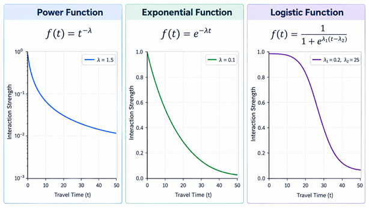

# Glossary

## Terms

### Accessibility

In the geography context, accessibility typically means *spatial* accessibility, which is a key concept in economic and social geography: "In the most general sense, accessibility is the ease of reaching destinations. The term can be used for people to describe the ease with which they can reach places they want to go, such as hospitals, schools, shops, workplaces or national parks; accessibility can also be used in reference to places, to describe how easily one place or location, say for a business, can be reached by people in other places"[1]. Accessibility is typically not just distance, but rather a multi-attribute measure of multiple opportunities weighted by distances (or, more generally, [travel costs](#travel-costs))[2].  

### Customer origins

A customer origin may be any subregion where the actual or potential demanders of a supply location are located. Typically, it is their place of residence (e.g., municipalities, ZIP code areas, census tracts)[3].

### Distance-decay function

Distance-decay functions are a core principle of all spatial interaction models in spatial economics. A distance-decay function describes mathematically how the intensity of interaction between locations decreases as the distance, travel time, or travel expenses between them increases. This function is typically implemented in market area or accessibility models for the (nonlinear) weighting of travel costs[3][4]. Frequently used distance-decay functions are the power and the exponential functions; however, some studies also use a logistic function. The figure displays the typical appearance of the three mentioned functions:

Source: own illustration with ChatGPT

### Distance-dependent demand

Distance-dependent demand is a fundamental assumption of spatial economics, which means that the demand for goods declines with rising distance or travel time due to increasing transport costs (or travel costs) incurred by customers[4][5]. In mathematical models, distance-dependent demand may be expressed by a [distance-decay function](#distance-decay-function).

### GIS-based network analysis

Calculating street distances or travel times, whether by car or by another mode of transport, requires actual road networks represented as line geometries. Using a [GIS (Geographic Information System)](https://en.wikipedia.org/wiki/Geographic_information_system), these networks can be converted into a routable network of edges and nodes, with the network segments assigned specific weights (e.g., average travel speed, one-way restrictions, or travel distance). Based on this network, mathematical routing algorithms, such as [Dijkstra's algorithm](https://en.wikipedia.org/wiki/Dijkstra%27s_algorithm), are used to calculate the shortest paths and, where appropriate, the corresponding travel distances or travel times[6]. Various commercial providers are available as data sources, as is road network data from OpenStreetMap, which is largely considered to be on par with that of commercial providers[7].

### Interaction matrix

An interaction matrix is ​​a long table containing all actual and/or potential spatial interactions between $$I$$ ($$i = 1,2,...,I$$) origin locations and $$J$$ ($$j = 1,2,...,J$$) destination locations. Typically, it also includes [travel costs](#travel-costs) from $$i$$ to $$j$$, as well as further information characterizing the origins and destinations[3]. An interaction matrix is the basis for market area models such as the [Huff Model](huff-model.md) and accessibility models such as the [Two-Step Floating Catchment Area Analysis](2sfca.md). 

### Market area

A market area (sometimes also referred to as catchment area, trading area, or service area) is a part of the Earth's surface where the (actual or potential) customers of a [supply location](#supply-locations) are located. It has a geographical outer boundary and may also be spatially subdivided into zones with different levels of market penetration. The total market area of a supply location may be regarded as the spatial equivalent to its total customers or sales[3][4][8]. The rationale behind the delineation and segmentation of market areas is [distance-dependent demand](#distance-dependent-demand). From a marketing perspective, delineating and segmenting a market area is a part of *geographic market segmentation*[8]. 

### Market area model

A market area model is a mathematical model for the delineation and segmentation of [market areas](#market-area) of [supply locations](#supply-locations). Outcomes of market area models may be customer or expenditure flows from [customer origin](#customer-origins) $$i$$ to supply location $$j$$ or the corresponding market shares. It is a mathematical alternative (deductive approach) to the purely empirical delineation and segmentation of market areas via customer spotting or household surveys (inductive approach). However, market area analysis typically involves a combination of empirical and mathematical approaches, especially when market area models are calibrated with observed data, as, for example, in the [MCI Model](mci-model.md) or in the [global optimization of the Huff Model](huff-fitting-global.md)[3]. Since market area models implicitly make a statement about consumer decisions, they also fall under the category of *store choice models*. Since they represent spatial interactions (between customer origins and supply locations) and take [travel costs](#travel-costs) into account, they also belong to the *spatial interaction models*[9].

### Supply locations

Supply locations are locations of firms that consumers must travel to in order to purchase goods or services for them (fixed-location retail and service establishments). This may include retail stores or retail agglomerations such as shopping malls, or any other type of fixed-location supplier, including health services, cinemas, or amusement parks[3]. 

### Travel costs

In spatial economics, the costs of overcoming distance are grouped under the term *transport costs*. When consumers travel to supply locations, the term *travel costs* is frequently used as well[4][5]. In some [market area models](#market-area-model), such as the [Huff Model](huff-model.md), travel costs are explicitly defined as travel *time*. Other forms of travel costs may also be used: in the simplest case, straight-line distances are calculated, although these do not account for the actual road network or traffic conditions. When calculating travel times or street distances, [GIS-based network analysis](#gis-based-network-analysis) with real road networks is necessary. Public transport travel times cannot be modeled directly using road networks; instead, they must be calculated based on timetable data (e.g., [GTFS](https://de.wikipedia.org/wiki/General_Transit_Feed_Specification)). The explicit use of time intended to allow travel time to be interpreted as [opportunity cost](https://en.wikipedia.org/wiki/Opportunity_cost) in the microeconomic sense[3].

## References

[1] Aoyama Y, Murphy JT, Hanson S (2011) Key Concepts in Economic Geography. London: SAGE.

[2] Rauch S, Wieland T, Rauh J (2025) Accessibility of food - A multilevel approach comparing a choice based model with perceived accessibility in Mainfranken. *Journal of Transport Geography* 128: 104367. [10.1016/j.jtrangeo.2025.104367](https://doi.org/10.1016/j.jtrangeo.2025.104367)

[3] Wieland T (2017) Market Area Analysis for Retail and Service Locations with MCI. *R Journal* 9(1): 298-323. [10.32614/RJ-2017-020](https://doi.org/10.32614/RJ-2017-020)

[4] Rodrigue JP, Comtois C, Slack B (2006) The Geography of Transport Systems. London/New York: Routledge.

[5] Wieland T (2021) Spatial Shopping Behavior in a Multi-Channel Environment: A Discrete Choice Model Approach. *REGION* 8(2): 1-27. [10.18335/region.v8i2.361](https://doi.org/10.18335/region.v8i2.361)

[6] Miller H, Shaw SL (2015) Geographic Information Systems for Transportation in the 21st Century. *Geography Compass* 9(4): 180-189. [10.1111/gec3.12204](https://doi.org/10.1111/gec3.12204)

[7] HeiGIT (2026) OpenStreetMap data as a basis for routing—how well does it really work? [https://heigit.org/openstreetmap-data-as-a-basis-for-routing-how-well-does-it-really-work/](https://heigit.org/openstreetmap-data-as-a-basis-for-routing-how-well-does-it-really-work/)

[8] Levy M, Weitz BA, Grewal D (2014) *Retailing Management*. New York: McGraw Hill.

[9] Wieland T (2018) A Hurdle Model Approach of Store Choice and Market Area Analysis in Grocery Retailing. *Papers in Applied Geography* 4(4): 370-389. [10.1080/23754931.2018.1519458](https://doi.org/10.1080/23754931.2018.1519458)