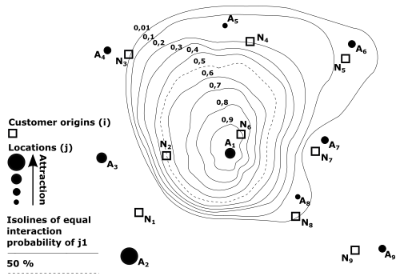
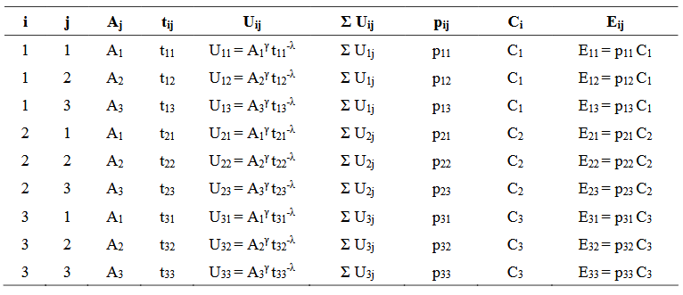
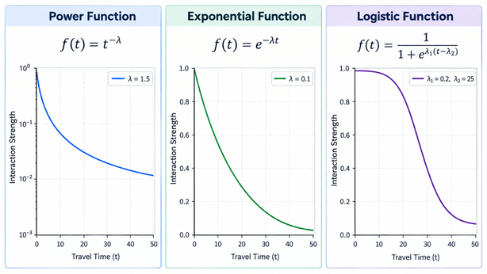

# Huff Model

## Background

David L. Huff[1][2][3] developed the market area model named after him based on his critique of earlier models, specifically the *Law of Retail Gravitation* by W. J. Reilly[4] and the subsequent *Breaking Point Formula* by P. D. Converse[5]. These earlier models were deterministic, meaning they precisely delineated market areas, implying no overlap between them, which is unrealistic. Furthermore, they considered only two competing locations. In contrast, Huff proposed a probabilistic model in which the outcome is the probability of customers visiting a specific location in a system of customer origins and supply locations. The *Huff Model* is part of classical retail location theory[6].

## Model formulation

In a spatial market, there are $$I$$ customer origins ($$i = 1, ..., I$$) and $$J$$ supply locations ($$j = 1, ..., J$$). In the basic Huff Model, the utility of supply location $$j$$ for the customers in customer origin $$i$$, $$U_{ij}$$ is[1][2]:

$$U_{ij} = A_j^{\gamma} t_{ij}^{-\lambda}$$

where $$A_j$$ is the attraction (size) of supply location $$j$$, $$t_{ij}$$ is the travel time from $$i$$ to $$j$$, and $$\gamma$$ and $$\lambda$$ are weighting parameters.

Huff[1] argued that the size of a location is a proxy variable for its product range. Since consumers possess only incomplete information, the probability of their obtaining the products they wish to purchase should increase with the product range of a supply location. For this reason, location size should have a positive effect; that is, the weighting exponent should be positive. However, the positive effect of having a choice should diminish due to the associated rise in search and decision costs, which means [diminishing marginal utility](https://en.wiktionary.org/wiki/law_of_diminishing_marginal_utility). Thus, the expected range of the corresponding weighting coefficient is: $$0 < \gamma < 1$$. In contrast, travel time is perceived as disproportionately negative. Huff regards it as the [opportunity cost](https://en.wikipedia.org/wiki/Opportunity_cost) of overcoming distance, regardless of the mode of transport. The value of the weighting exponent should therefore typically be: $$\lambda > 1$$.

Huff referred to the *Luce Choice Axiom*[7] from behavorial science when modeling the probability of choice. Given $$I$$ customer origins ($$i = 1,2,...,I$$) and $$J$$ supply locations ($$j = 1,2,...,J$$), the interaction probability (or market share) of origin $$i$$ with respect to location $$j$$, equals[1][2]:

$$p_{ij} = \frac{U_{ij}}{\sum_{j=1}^J U_{ij}}$$

Huff probabilities may be plotted in a [contour map](https://en.wikipedia.org/wiki/Contour_line). For a schematic representation of interaction probabilities based on the spatial distribution of competitors at a given location, see here:

Source: [8], modified

The expected customer or expenditure flows from customer origin $$i$$ to supply location $$j$$, $$E_{ij}$$, is[1][2]:

$$E_{ij} = p_{ij} C_i$$

where $$C_i$$ is the customer or expenditure potential in origin $$i$$.

The total expected customer or expenditure flow to location $$j$$, $$T_j$$, equals[3]:

$$T_j = \sum_{i=1}^I E_{ij}$$

where $$T_j$$ is the total customers or turnover of supply location $$j$$, depending on the definition of $$C_i$$.

## Empirical application

A market area analysis using the basic Huff Model involves the following steps:

1. Define a study area and divide it into $$I$$ customer origins (e.g., municipalities, ZIP code areas, census tracts)
2. Identify the relevant $$J$$ supply locations competing within the study area
3. Collect the attraction values $$A_j$$ (e.g., size) of all $$J$$ supply locations and the customer potentials $$C_i$$ (e.g., people, EUR, $) of all customer origins
4. [Calculate travel costs](#calculation-of-travel-costs) $$t_{ij}$$ for all $$I \times J$$ origin-destination combinations and store them in a travel cost matrix
5. [Define weighting functions](#weighting-functions) and the corresponding parameters for $$A_j$$ and $$t_{ij}$$
6. Calculate utilities $$U_{ij}$$, probabilities $$p_{ij}$$, and expected customer/expenditure flows $$E_{ij}$$
7. Sum the expected values $$E_{ij}$$ for each supply location as $$T_{j}$$

If the goal of the Huff analysis is to model changes in market areas (e.g., due to new supply locations, changes in location sizes, or changes in travel costs), define the respective scenario and re-calculate the Huff Model:

8. Add new supply locations, update existing locations, or update travel costs
9. Repeat steps 6 and 7
10. Compare market areas and total expected customers/expenditures

The complete data of a Huff Model calculation is stored in an *interaction matrix* with $$I \times J$$ rows:

Source: [8], modified

## Calculation of travel costs

In spatial economics, the costs of overcoming distance are grouped under the term *transport costs* or, when consumers travel to supply locations, the term *travel costs* is frequently used as well[8]. In the Huff Model, these transport/travel costs are explicitly expressed as travel *time*. Calculating travel times, whether by car or by another mode of transport, requires actual road networks represented as line geometries. Using a [GIS (Geographic Information System)](https://en.wikipedia.org/wiki/Geographic_information_system), these networks can be converted into a routable network of edges and nodes, with the network segments assigned specific weights (e.g., average travel speed, one-way restrictions, or travel distance). Based on this network, mathematical routing algorithms, such as [Dijkstra's algorithm](https://en.wikipedia.org/wiki/Dijkstra%27s_algorithm), are used to calculate the shortest paths and, where appropriate, the corresponding travel distances or travel times[9]. 

In the Huff Model, travel time must be calculated for each of the $$I×J$$ origin–destination (OD) combinations and stored in a OD travel cost matrix[10]. However, other forms of travel costs may also be used: in the simplest case, straight-line distances are calculated, although these do not account for the actual road network or traffic conditions. Public transport travel times cannot be modeled directly using road networks; instead, they must be calculated based on timetable data (e.g., [GTFS](https://de.wikipedia.org/wiki/General_Transit_Feed_Specification)).

## Weighting functions

The weighting of travel time is typically referred to as [distance decay function](https://en.wikipedia.org/wiki/Distance_decay), which is a core principle of all spatial interaction models in spatial economics, describing how the intensity of interaction between locations decreases as the distance/travel time between them increases[10]. In the basic Huff Model, both explanatory variables enter the utility function in power form. However, other weighting functions are also used in studies applying the Huff Model, particularly for travel time, such as exponential or logistic functions[10][11][12][13][14][15].

Source: own illustration with ChatGPT

## Further notes

The model implies a market-clearing condition in the sense that the total demand originating from the included demand locations is allocated across the set of included supply locations: $$\sum^J_{j=1} T_{j} = \sum^I_{i=1} C_i$$. Consequently, the delineation of the study area has a strong impact on the model results. 

Due to the nonlinear nature of the model, the choice of the weighting functions and corresponding weighting parameters have a strong influence on the model results. Calibrating the Huff Model, i.e., estimating weighting parameters based on empirically observed choice behavior, may be conducted using the [MCI Model](mci-model.md) or [iterative fitting procedures](huff-fitting-global.md). Alternatively, it is possible to [optimize the attraction values iteratively](huff-fitting-local.md) based on observed turnovers.

## References

[1] Huff DL (1962) *Determination of Intra-Urban Retail Trade Areas*. Los Angeles: Real Estate Research Program, Graduate Schools of Business Administration, University of California.

[2] Huff DL (1963) A Probabilistic Analysis of Shopping Center Trade Areas. *Land Economics* 39(1): 81-90. [10.2307/3144521](https://doi.org/10.2307/3144521)

[3] Huff DL (1964) Defining and estimating a trading area. *Journal of Marketing* 28(4): 34–38. [10.2307/1249154](https://doi.org/10.2307/1249154)

[4] Reilly WJ (1931) The law of retail gravitation. New York: Knickerbocker Press.

[5] Converse PD (1949) New Laws of Retail Gravitation. *Journal of Marketing* 14(3): 379-384. [10.1177/002224295001400303](https://doi.org/10.1177/002224295001400303)

[6] Brown S (1993) Retail location theory: evolution and evaluation. *The International Review of Retail, Distribution and Consumer Research* 3(2): 185-229. [10.1080/09593969300000014](http://dx.doi.org/10.1080/09593969300000014)

[7] Luce RD (1959) Individual choice behavior: a theoretical analysis. John Wiley.

[8] Wieland T (2015) *Räumliches Einkaufsverhalten und Standortpolitik im Einzelhandel unter Berücksichtigung von Agglomerationseffekten - Theoretische Erklärungsansätze, modellanalytische Zugänge und eine empirisch-ökonometrische Marktgebietsanalyse anhand eines Fallbeispiels aus dem ländlichen Raum Ostwestfalens/Südniedersachsens*. Geographische Handelsforschung 23. Mannheim: MetaGIS. https://nbn-resolving.org/urn:nbn:de:bvb:20-opus-180753

[9] Miller H, Shaw SL (2015) Geographic Information Systems for Transportation in the 21st Century. *Geography Compass* 9(4): 180-189. [10.1111/gec3.12204](https://doi.org/10.1111/gec3.12204)

[10] Wieland T (2017) Market Area Analysis for Retail and Service Locations with MCI. *R Journal* 9(1): 298-323. [10.32614/RJ-2017-020](https://doi.org/10.32614/RJ-2017-020)

[11] Bai L, Tao Z, Cheng Y, Feng L, Wang S (2023) Delineating hierarchical obstetric hospital service areas using the Huff model based on medical records. *Applied Geography* 153: 102903. [10.1016/j.apgeog.2023.102903](https://doi.org/10.1016/j.apgeog.2023.102903)

[12] De Beule M, Van den Poel D, Van de Weghe N (2014) An extended Huff-model for robustly benchmarking and predicting retail network performance. *Applied Geography* 46(1): 80–89. [10.1016/j.apgeog.2013.09.026](https://doi.org/10.1016/j.apgeog.2013.09.026)

[13] Fotheringham AS (1985) Spatial Competition and Agglomeration in Urban Modelling. *Environment and Planning A: Economy and Space* 17(2): 213-230. [10.1068/a170213](https://doi.org/10.1068/a170213)

[14] Kanhäusser C (2007) Modellierung und Prognose von Marktgebieten am Beispiel des Möbeleinzelhandels. In: Klein R, Rauh J (eds.) *Analysemethodik und Modellierung in der geographischen Handelsforschung*, 75-110. Geographische Handelsforschung 13. Passau: L.I.S.

[15] Wieland T (2018) Modellgestützte Verfahren und "big (spatial) data" in der regionalen Versorgungsforschung II: Räumliche Interaktionsmodelle. *Monitor Versorgungsforschung* 11(3): 59-64. [10.24945/MVF.03.18.1866-0533.2083](https://doi.org/10.24945/MVF.03.18.1866-0533.2083)