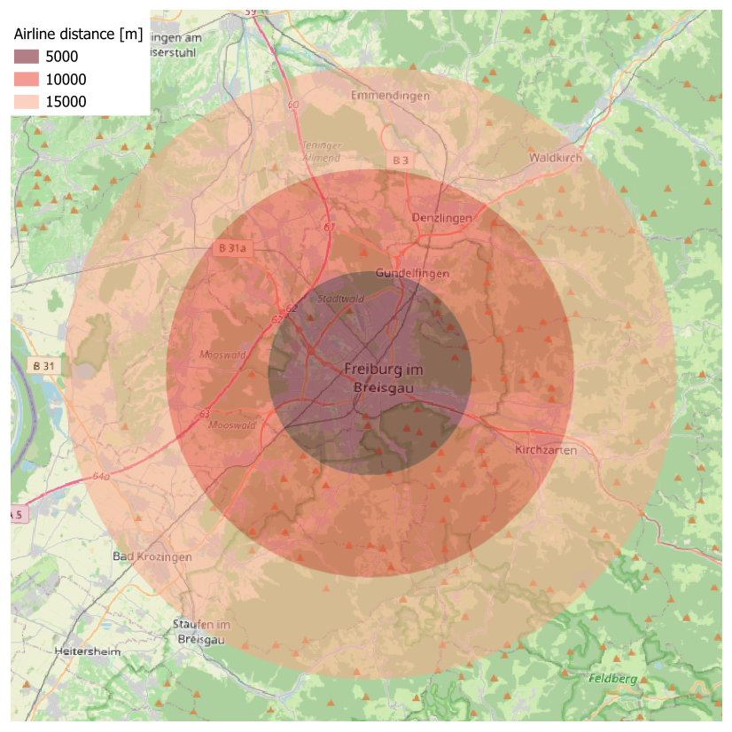
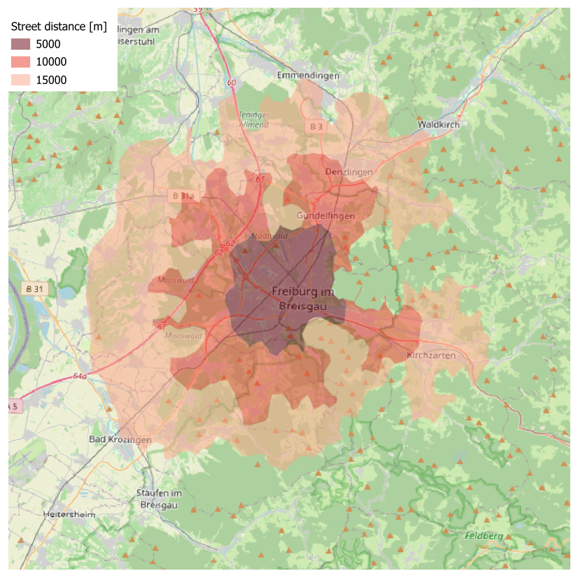
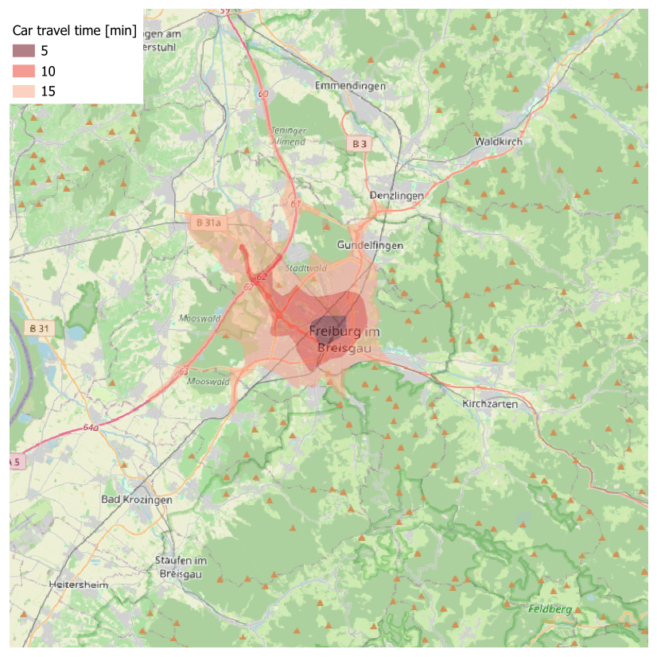

# Simplified Delineation of a Market Area

## Background

Given an existing [supply location](glossary.md#supply-locations), a [market area](glossary.md#market-area) may be delineated empirically using customer spotting techniques, e.g., via surveys or loyalty card data. The simplest way to delineate a market area of a new supply location (or when no empirical data on customers are available) is to define a zone around a location based on a maximum distance or travel time. This maximum may be interpreted as a catchment threshold indicating an (artificial) limit beyond which demanders are no longer taken into account. The [customer origins](glossary.md#customer-origins) within the resulting area are regarded as a part of the market area. The total area may also be segmented geographically[1][2]. In a [GIS (Geographic Information System)](https://en.wikipedia.org/wiki/Geographic_information_system) context, assigning the origins to the market area may be undergone with overlay analysis, more precisely: with a [spatial join](https://en.wikipedia.org/wiki/Spatial_join)[3]. The methods of delineation differ in terms of how the (approximated) market area is calculated or which type of [travel costs](glossary.md#travel-costs) is used as a basis.

## Buffers

As a first approximation, a market area may be delineated using a [buffer](https://en.wikipedia.org/wiki/Buffer_analysis). In the simplest case, a point (coordinates of the supply location) serves as the basis, around which a radius $$r$$ is drawn, resulting in an area with a diameter of $$2r$$. This is an example of three buffer zones (0-5, 5-10, and 10-15 kilometers) around Freiburg main station:

Source: own illustration (Base map: OpenStreetMap)

Buffer and overlay analyses are standard applications in a GIS context that have frequently been used in location planning in the past[3]. Apart from the input locations, they require no additional data. However, they do not take into account actual traffic conditions (road network, one-way streets, natural barriers such as mountains or rivers). In contrast, [accessibility](glossary.md#accessibility) is expressed in terms of straight-line distance, which implies a homogeneous surface. 

## Road distances and travel times

While the aforementioned buffer analysis is based on straight-line distances, it is also possible to use road distances or travel times as a basis. Calculating road distances or travel times, whether by car or by another mode of (individual) transport, requires [GIS-based network analysis](glossary.md#gis-based-network-analysis) using real road networks. Consequently, more data and significantly greater computing capacity are required than for buffer analysis. This is an example of three street distance zones (0-5, 5-10, and 10-15 kilometers) around Freiburg main station:

Source: own illustration (Base map: OpenStreetMap)

This is an example of three car travel time zones (0-5, 5-10, 10-15 minutes) around Freiburg main station:

Source: own illustration (Base map: OpenStreetMap)

Street distance and travel times thus take into account realistic traffic conditions, however, this depends on the underlying network data. The network calculations presented here were conducted via [OpenRouteService](https://openrouteservice.org/), with the road network being based on [OpenStreetMap](https://www.openstreetmap.org/) data. 

## Further notes

The same methodology may be applied in [accessibility](glossary.md#accessibility) analysis. In these cases, the proximity analysis is mostly conducted from the customer origins level. Furthermore, the basic [Two-Step Floating Catchment Area Analysis](2sfca.md) is based on a distance-specific delineation.

Results of customer spotting may be used for the parametrization of [distance-decay functions](glossary.md#distance-decay-function)[2].

Customer spotting data and pre-defined market areas (such as buffers, isochrones etc.) may be combined. For example, empirically recorded customer locations can be overlaid with predefined catchment area radii, distances, or travel times.

## References

[1] Levy M, Weitz BA, Grewal D (2014) *Retailing Management*. New York: McGraw Hill.

[2] Wieland T (2017) Market Area Analysis for Retail and Service Locations with MCI. *R Journal* 9(1): 298-323. [10.32614/RJ-2017-020](https://doi.org/10.32614/RJ-2017-020)

[3] Benoit D, Clarke GP (1997) Assessing GIS for retail location planning. *Journal of Retailing and Consumer Services* 4(4): 239-258. [10.1016/S0969-6989(96)00047-1](https://doi.org/10.1016/S0969-6989(96)00047-1)
